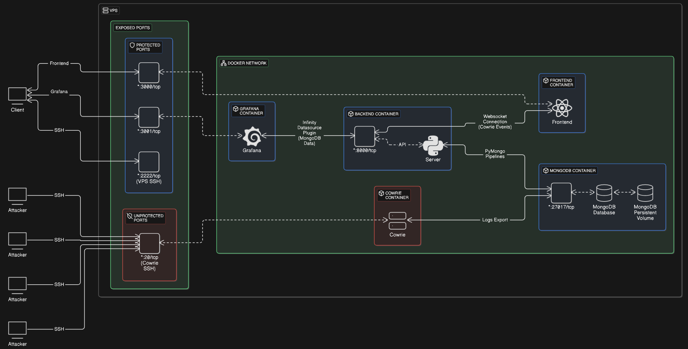

# 🌍 CyberPot – Honeypot Visualization Platform

**CyberPot** is an lightweight, hackable and open-source, research-oriented honeypot platform designed to capture and visualize cyberattacks in real time. It provides an educational-friendly and modular environment that supports threat analysis, DevSecOps training, and public demonstrations of cybersecurity concepts.
With Cowrie as the SSH honeypot, MongoDB for structured data storage, and Grafana (powered by the Infinity plugin) for dashboard-based exploration, CyberPot bridges low-level event capture with high-level visualization.
You can explore real-time logs on an interactive **3D globe** or create **advanced Grafana dashboards** to analyze patterns, sources, and attack metadata.

----

## 🔥 What It Does?

- Captures unauthorized SSH activity via **Cowrie** and stores data in **MongoDB**
- Visualizes attacks as animated arcs between attacker and honeypot server location on a **3D globe** using **three-globe** (WIP)
- Uses **Grafana dashboards** for attack metadata visualization and research purposes

Offers full flexibility for research, visualization, and educational use cases

---

## 📡 MVP Components

- Cowrie (SSH Honeypot) – exposes fake SSH services to attract and log attackers
- MongoDB – stores structured logs for both visualization and analytics
- Backend (Python + FastAPI) – handles API for Grafana and WebSocket data stream for the frontend
- Frontend (React + TypeScript + TailwindCSS) – renders the animated globe and real-time attack events
- Grafana – provides powerful dashboards using Infinity plugin connected to backend API (MongoDB data)

---

## 🖥️ Architecture

---

## 🛰️ Live Attack Example

---

## ⚠️ Disclaimer

This project is provided **for educational and research purposes only**.  
The authors and contributors take **no responsibility** for any use of this software.  
Do not deploy this in environments where it could interfere with production systems or violate legal boundaries.

---

## 🧩 Next Steps (WIP)

- [ ] IP geolocation via GeoLite2 or IP2Location
- [ ] Threat feed export (STIX, JSON, etc.)
- [ ] Tagging and enriching attacker metadata
- [ ] Improved alerting and monitoring capabilities
- [ ] Public deployment on Hetzner
- [ ] Additional Grafana dashboards and UI improvements

---
